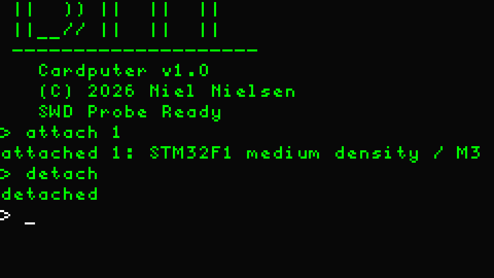
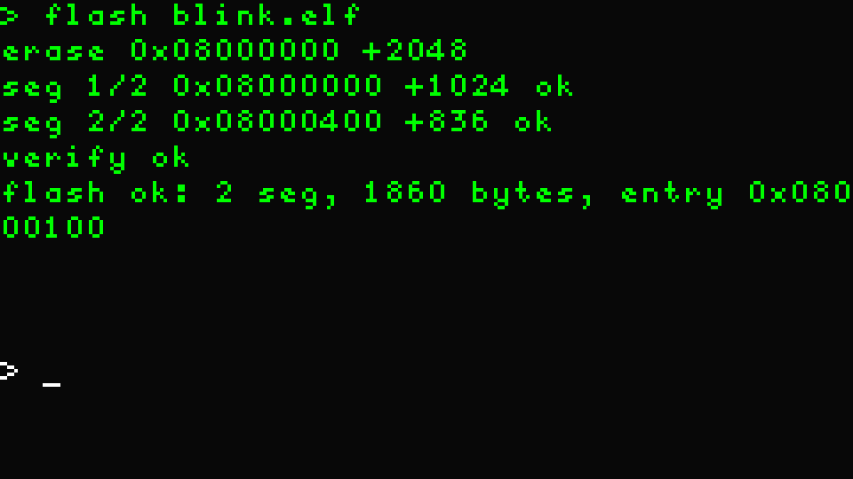
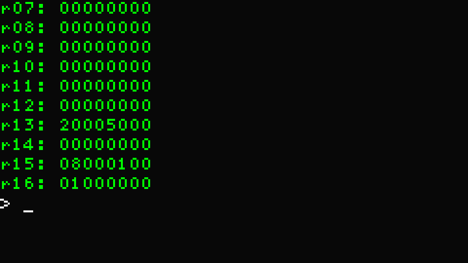
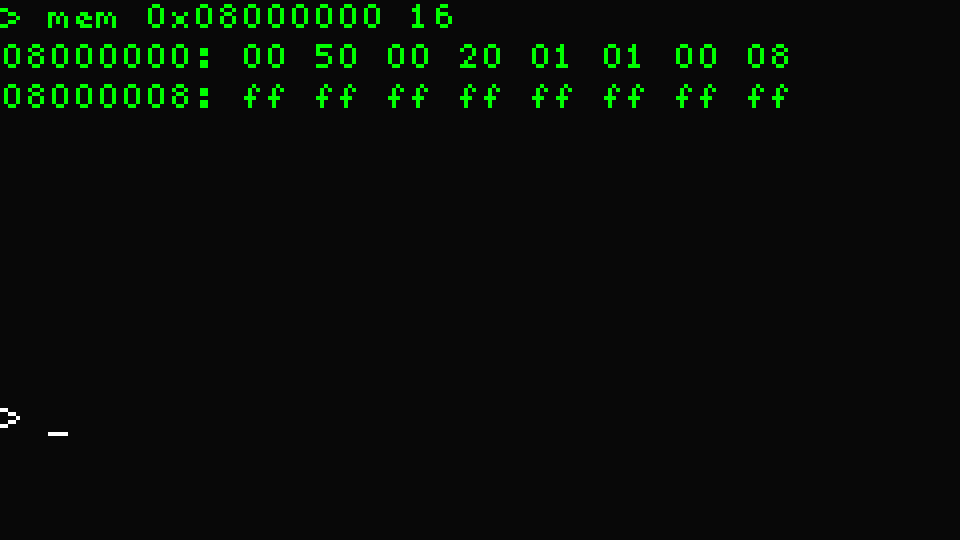
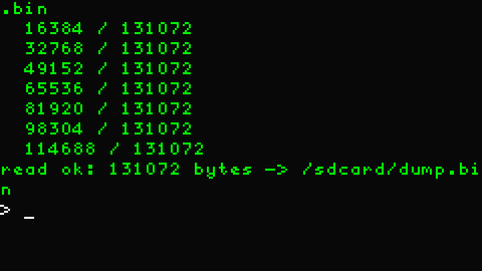
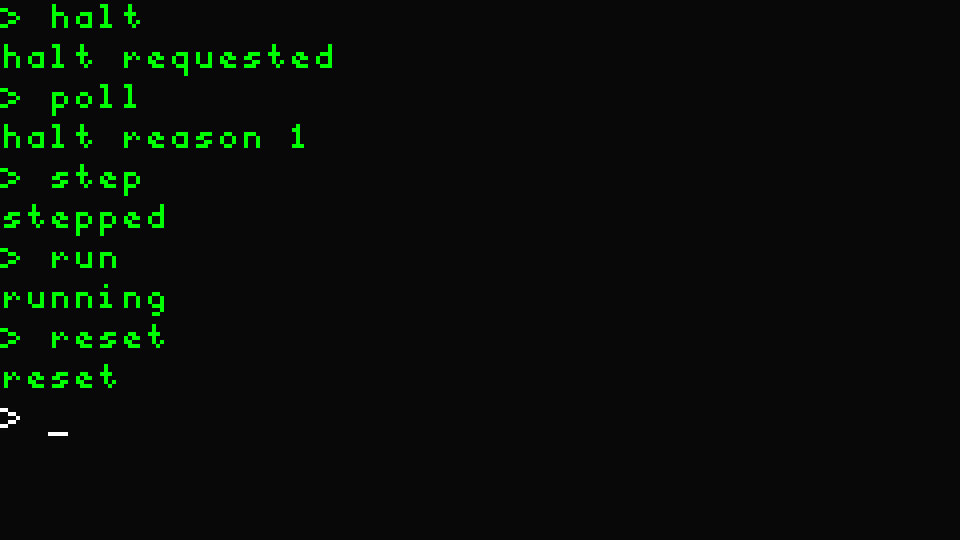
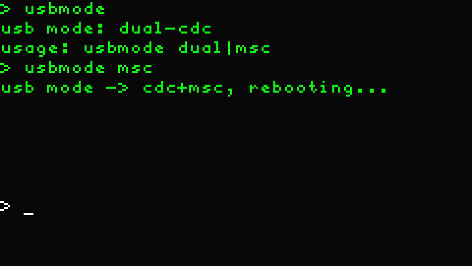
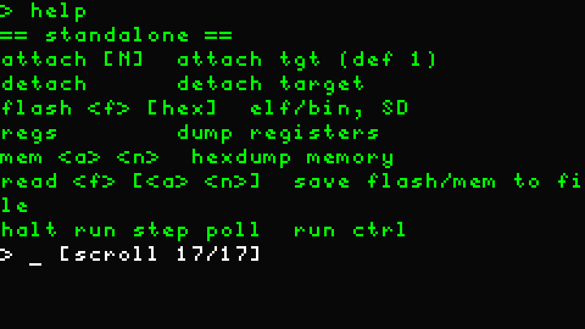
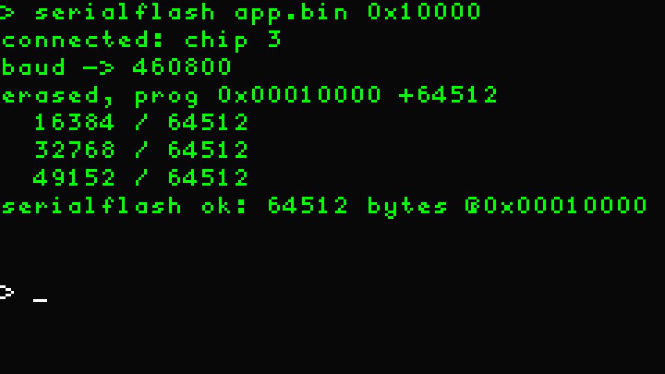

### On-screen examples

Rendered mockups of the standalone verbs on the Cardputer console (240×135
ST7789, font6x9). Generated from the firmware's actual output strings; register
and memory values shown are the emulated STM32F1's seed state.

| | |
|---|---|
| **attach / detach** — attach to the emulated STM32F1, then detach  | **flash** — program a two-segment ELF, erase → write → verify  |
| **regs** — core register dump (sp, pc, xPSR of the halted-at-reset seed)  | **mem** — hex-dump the vector table: SP, reset vector, erased flash  |
| **read** — whole-flash dump to `/sdcard/dump.bin` with progress  | **halt / poll / step / run / reset** — run control  |
| **usbmode** — query, then switch to CDC+MSC (reboots)  | **help** — curated standalone list, scrolled back with `Fn+;`  |
| **serialflash** — UART-flash an ESP SoC over Grove: connect, program, MD5-verify  | |
