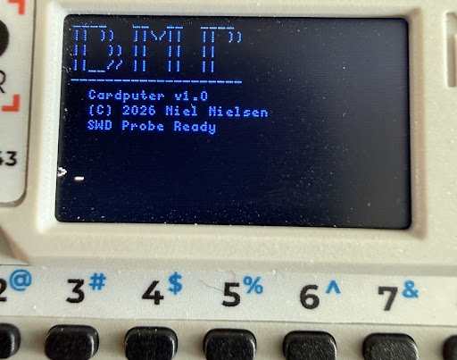

# Black Magic Probe on M5Stack Cardputer

A port of [litui/blackmagic-esp32s3](https://github.com/litui/blackmagic-esp32s3) to the
[M5Stack Cardputer](https://docs.m5stack.com/en/core/Cardputer), adding an on-device
keyboard REPL and scrollable display console alongside the standard BMP USB functionality.

On top of the monitor REPL, the Cardputer can **attach, inspect, and flash a target
entirely on its own**, with no host GDB session. Point it at a firmware image on a microSD
card and it becomes a self-contained debugger/flasher: scan, attach, program from `.elf`
or `.bin`, dump registers and memory, and drive run control from the keyboard.



## Hardware

- **MCU**: ESP32-S3FN8 (no PSRAM)
- **Display**: ST7789, 135×240, SPI
- **Keyboard**: 8×7 IO-matrix over 74HC138 demux
- **SWD**: Grove port (G1=SWDIO, G2=SWCLK, GND)
- **microSD**: SPI, holds firmware images for on-device flashing (mounted at `/sdcard`)

No NRST pin is wired. Use `monitor connect_rst enable` in GDB, or the `connect_rst`
monitor command in the REPL, if the target requires connect-under-reset.

## Features

- **Dual USB-CDC**: COM port 1 (GDB remote protocol), COM port 2 (UART/debug mirror)
- **On-device REPL**: Type BMP monitor commands directly on the Cardputer keyboard.
  Full shift layer supported — hold `Aa` for uppercase and symbols including `_`, `!`,
  `@`, `#`, `$`, `%`, etc.
- **Standalone debugger/flasher**: Attach to a target, flash an `.elf`/`.bin` from the
  microSD, read registers and memory, and control run state, all without a host. See
  [Standalone debugging and flashing](#standalone-debugging-and-flashing-no-host)
- **Auto pin detection**: `swd_scan` automatically tries both Grove pin orderings before
  connecting — no need to care which wire landed on SWDIO vs SWCLK
- **Scrollable history**: 50-line scrollback buffer, navigate with `Fn+;` (back) and
  `Fn+.` (forward)
- **USB output mirror**: All command output simultaneously sent to COM port 2 as raw
  text, open in any terminal (flow control: None) to capture full output
- **Boot animation**: Startup splash with progress bar and BMP logo

## Supported monitor commands

```
version        Display firmware version info
help           Display help for monitor commands
jtag_scan      Scan JTAG chain for devices
swd_scan       Scan SWD interface for devices: [TARGET_ID]
swdp_scan      Deprecated: use swd_scan instead
auto_scan      Automatically scan all chain types for devices
frequency      Set minimum high and low times: [FREQ]
targets        Display list of available targets
morse          Display morse error message
halt_timeout   Timeout to wait until Cortex-M is halted: [TIME]
connect_rst    Configure connect under reset: [enable|disable]
reset          Pulse the nRST line: [PULSE_LEN, default 0ms]
tdi_low_reset  Pulse nRST with TDI set low (wakes certain targets eg LPC82x)
rtt            RTT control: [enable|disable|status|channel|ident|cblock|ram|poll]
heapinfo       Set semihosting heapinfo: HEAP_BASE HEAP_LIMIT STACK_BASE STACK_LIMIT
debug_bmp      Output BMP debug strings to second vcom: [enable|disable]
swd_pinout     Brute-force SWD pinout scan across Grove pins: [pin1 pin2 ...]
```

Target-specific commands (eg nRF52 recovery AP) become available once a target is
attached via `swd_scan`.

## Standalone debugging and flashing (no host)

These verbs run on the Cardputer itself. They are dispatched from the REPL before it
falls through to `command_process()`, so they coexist with every monitor command above.

```
attach [N]          Attach to target N from the last scan (default 1)
detach              Detach the current target
flash <path> [hex]  Program an ELF or .bin from /sdcard. For a raw .bin, [hex] is
                    the load base (default 0x08000000). ELF uses each segment's LMA.
regs                Dump core registers
mem <hex> <len>     Hex-dump len bytes of target memory (len capped at 256)
reset               Reset the attached core, or pulse nRST if none attached
halt                Request halt
run                 Resume execution
step                Single-step
poll                Report halt reason
```

Typical standalone flow, all from the keyboard:

```
swd_scan                       # populate the target list
connect_rst enable             # only if the target needs it (no NRST wired)
attach 1                       # attach to target 1
flash /sdcard/firmware.elf     # erase, program, verify from SD
reset
run
```

`flash` auto-detects ELF vs raw binary from the file header. Progress and the final
`segments / bytes / entry` summary print to the scrollback and the COM port 2 mirror.

## microSD

Firmware images are read from a FAT-formatted microSD, mounted at `/sdcard` at boot.
Copy your `.elf` or `.bin` to the card, insert it, and reference it by path in `flash`.

The SD SPI pins in `main/sdcard.c` default to the documented Cardputer values.
**Confirm these against your unit.** If the card shares the SPI host with the ST7789
display, set `SDCARD_SHARED_BUS 1` in `sdcard.c` and point `SD_SPI_HOST` at the host
the display already initialized, so the bus is not initialized twice.

If no card is present at boot the mount is skipped with a warning and flash-from-file is
simply unavailable — everything else (probe, REPL, host GDB) works unchanged.

## Supported targets (compiled in)

nRF51/nRF52, STM32F1/F4/G0/H5/H7/L0/L4/MP15, RP2040, SAMD/SAM3x/SAM4L/SAMx5x,
LPC11xx/15xx/17xx/40xx/43xx/546xx/55xx, Kinetis, EFM32, iMX-RT, Renesas RA/RZ,
RISC-V (RV32/RV64), nRF91, and more, see `blackmagic-fw/src/target/` for the full list.

## Build requirements

- **ESP-IDF v5.1.4**, not 5.3.x. TinyUSB's `dcd_esp32sx.c` (ESP32-S3 USB-OTG driver)
  depends on SoC register names that were reorganized in later IDF releases.

```sh
. ~/esp/esp-idf-5.1/export.sh
```

## Build

```sh
git clone https://codeberg.org/nieldk/blackmagic-cardputer.git
cd blackmagic-cardputer
git submodule update --init --recursive
rm -f sdkconfig
rm -rf build
idf.py -D SDKCONFIG_DEFAULTS=sdkconfig.defaults.cardputer set-target esp32s3
idf.py -D SDKCONFIG_DEFAULTS=sdkconfig.defaults.cardputer build
```

Both commands must receive `-D SDKCONFIG_DEFAULTS=sdkconfig.defaults.cardputer`. Running
`set-target` without it writes stock defaults that silently override the Cardputer config.

The patched `gdb_packet.c` and `command.c` are included in the repo root and copied
automatically into the `blackmagic-fw` submodule during the build. No manual patching
required after `git submodule update --init --recursive`.

## Flash

```sh
idf.py flash
```

## Wiring (SWD)

| Grove pin | GPIO | Target |
|-----------|------|--------|
| G1 | GPIO1 | SWDIO |
| G2 | GPIO2 | SWCLK |
| GND | GND | GND |

Power the target separately. `swd_scan` automatically tries both pin orderings, so the
cable can be plugged in either way. Use `swd_pinout` to explicitly identify which pin is
which.

## Connecting with GDB

```sh
arm-none-eabi-gdb your_firmware.elf
(gdb) target extended-remote COM29      # or /dev/ttyACM0 on Linux
(gdb) monitor connect_rst enable        # if no NRST wired
(gdb) monitor swd_scan
(gdb) attach 1
(gdb) load
(gdb) break main
(gdb) continue
```

## On-device REPL

- Type a command and press **Enter** to execute
- Hold **Aa** (shift) for uppercase and symbols: `_`, `!@#$%^&*()`, `{}|`, etc.
- **Fn + ;**: scroll back into history
- **Fn + .**: scroll forward to live view
- Pressing **Enter** always snaps back to live view

All command output also appears on **COM30** as plain text. Open in any terminal with
flow control set to **None**.

## Known limitations

- No NRST pin, use `connect_rst enable` for targets that require it
- No double buffering (no PSRAM), display redraws only on keypress to avoid flicker
- SWD only, JTAG wiring not brought out to the Grove port
- Keyboard Fn/Ctrl layers not decoded, only Fn+;/Fn+. scroll shortcuts are handled
- RTT and semihosting compiled in but untested
- SD pins default to documented Cardputer values, confirm for your unit and set
  `SDCARD_SHARED_BUS` if the card shares the display SPI bus

## Credits

Based on [litui/blackmagic-esp32s3](https://github.com/litui/blackmagic-esp32s3) and
the [Black Magic Debug](https://black-magic.org) project.
